# Data Employment Skills Dashboard  

## 📖 Index  

### 1. Introduction  
- #### 📌 Project Overview  
- #### 🎯 End Goals  
- #### 🔄 System Workflow Overview  
  - *Figure 1: Program Process Map*  

### 2. Scope & Limitations  
- #### 🌍 U.S.-Centric Dataset Bias  
  - *Figure 2: Job Postings by Location*  
- #### 📌 Job Title Standardization Challenges  
  - *Figure 3: Job Title Frequency Distribution*  
- #### 🔧 Skill Fragmentation & Scope Limitation  
  - *Figure 4: Skill Frequency Distribution*  

### 3. Repository Structure  
- #### 📂 Folder & File Organization  

### 4. Project Workflow Overview  
- #### 🚀 Sprint-Based Development Approach  
- #### 📌 Project Sprints Overview  
  - **Sprint 1**: Data Collection & Cleaning  
  - **Sprint 2**: Skill Extraction & Processing  
  - **Sprint 3**: Database & API Development  
  - **Sprint 4**: Dashboard Development  

### 5. Data Engineering Process  
- #### 📂 Data Sources & Licensing  
- #### 🔍 Data Cleaning & Processing  
  - *Handling Missing Values & Duplicates*  
  - *Job Title Normalization & Mapping*  
- #### ⚙️ ETL Workflow Explanation  

### 6. Skill Extraction & Ranking  
- #### 📊 Methodology  
- #### 🔍 Challenges & Solutions  
  - *Handling Variations in Skill Naming*  
  - *Limiting Focus to Top 20 Skills per Job Title*  
  - *Figure 1: Skill Frequency Distribution*  

### 7. Database & API Development  
- #### 📂 Database Choice & Justification  
- #### 🗂 Database Schema Design  
  - *Figure 2: MVP Database Schema*  
  - *Figure 3: Extended Database Schema*  
- #### 🖥 API Functionality  

### 8. Interactive Dashboard & Visualization  
- #### 🖥️ Frontend Implementation  
- #### 📌 Job Categorization Index Page  
  - *Figure 1: Job Categorization Index Page*  
- #### 📌 Job-Specific Dashboard  
  - *Figure 2: Job-Specific Dashboard*  
- #### 📌 Ethics & Considerations Page  
  - *Figure 3: Ethics & Considerations Page*  
- #### 🎨 User Experience & Design  

### 9. Future Enhancements & Next Steps  
- #### 🚀 Planned Enhancements  
  - *Expanding Job Categorization & Global Listings*  
  - *Live Data Updates & Web Scraping*  
  - *Custom Search Filters & Advanced User Features*  
  - *Improved Skill Extraction & NLP Integration*  
  - *User Authentication & Profile-Based Recommendations*  
- #### 📌 Long-Term Vision  

### 10. Installation & Execution  
- #### 🛠️ Pre-Requisites  
- #### 💻 Installation Steps  
- #### 🗂️ Database Setup (Manual MongoDB Installation Required)  
- #### 🔄 Running the Project (Fully Automated Execution)  
- #### 🌐 Platform-Specific Considerations (Mac vs. Windows)  

### 11. Conclusion  
- #### ✅ Key Takeaways  
- #### 🔮 Future Prospects  


## 1. Introduction  

### 📌 Project Overview  

The **Data Employment Skills Dashboard** is designed to help **job seekers, career changers, and data professionals** stay competitive by identifying **the most in-demand skills** in Data Science job postings. Job titles and required skills are often inconsistent across postings, making it difficult to understand what truly matters. Our tool **analyzes, ranks, and visualizes** these skills, providing **clear, data-driven insights** to support smarter career decisions.  

Our **interactive dashboard** allows users to:  
- 🔍 **Identify high-demand skills** based on real job postings.  
- 📊 **Explore job titles and skill rankings** in an intuitive interface.  
- 📈 **Compare their skillset** with industry trends to guide career growth.  

This project **extracts, categorizes, and ranks job skills**, making it easier for users to identify skill gaps and target relevant professional development opportunities.  

---

### 🎯 End Goals  

- ✅ **Provide job seekers with a clear understanding of in-demand skills.**  
- ✅ **Enable interactive exploration of job titles and skill rankings.**  
- ✅ **Offer real-world job market insights** using **real job postings** as a data source.  

---

### 🔄 System Workflow Overview  

The following process map outlines how the **Python scripts, MongoDB interactions, and system operations** work together to transform **raw job postings** into **actionable insights on the dashboard**.  

**Figure 1: Program Process Map**  
A **high-level overview of system operations**, covering data extraction, storage, API integration, and visualization.  
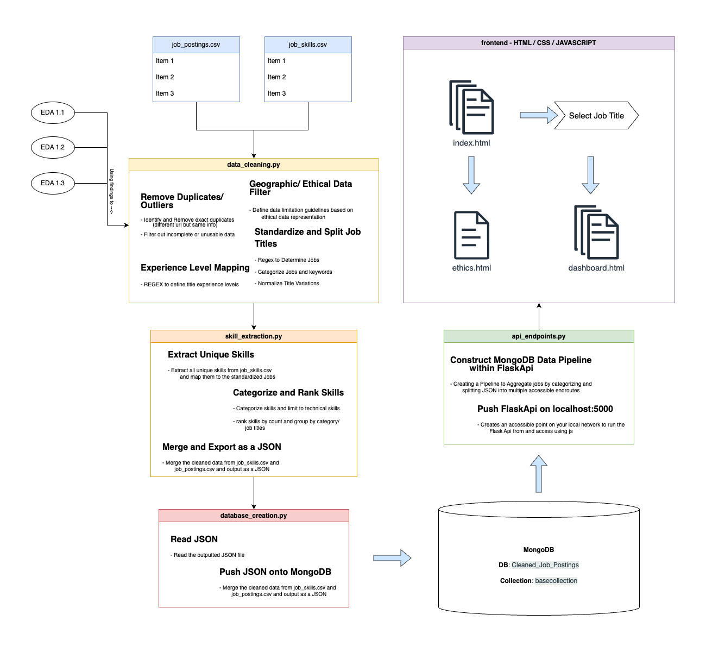  

This diagram illustrates the **full process**, from **data collection to interactive visualizations**, ensuring that job seekers can easily access and interpret job market trends.  

---

## 🔍 Scope & Limitations  

### 🌍 U.S.-Centric Dataset Bias  
- **Figure 2: Job Postings by Location**  
  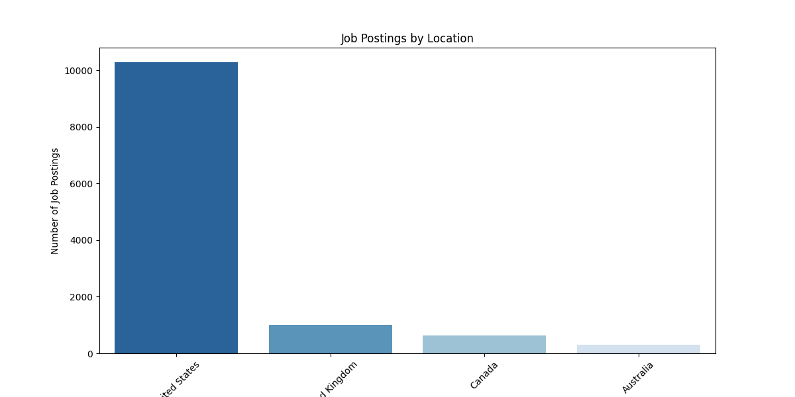  
- The dataset is heavily skewed toward **U.S.-based job postings**, making insights **less applicable to international job markets**.  
- The visualization above illustrates the **geographic bias** in the dataset.  

### 📌 Job Title Standardization Challenges  
- **Figure 3: Job Title Frequency Distribution**  
  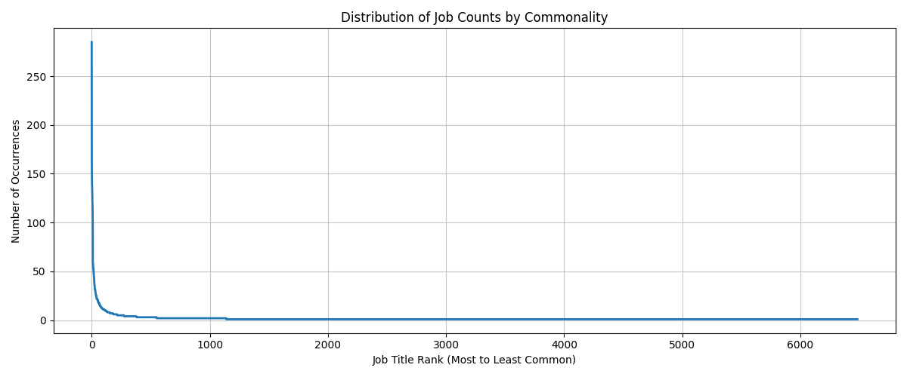  
- One of the **biggest challenges** in job market data analysis is **job title standardization**.  
- **~80% of job titles** in the dataset appear **only once**, making standardization and categorization difficult.  
- The **line graph above** represents the **distribution of job title occurrences**, highlighting the **long-tail nature** of job postings.  

### 🔧 Skill Fragmentation & Scope Limitation  
- **Figure 4: Skill Frequency Distribution**  
    
- Job postings frequently list **skills in inconsistent formats**, leading to **skill fragmentation**.  
- Considering **dataset limitations, time constraints, and our current skill levels**, we decided to **narrow the scope** to **14 representative job titles** and focus our **skill extraction on the top 20 skills per job category**.  
- Our approach ensures that the data remains **relatable, actionable, and as clean as possible**, reducing misinterpretation.  
- Unlike more advanced projects, **we did not use NLP, machine learning, or other complex AI-driven techniques**, as those are **beyond our current capabilities**. Instead, we relied on **Regex-based skill grouping** to maintain accuracy and clarity.    

---

## 2. Repository Structure

```
Data_Employment_Skills_Dashboard/
│
├── backend/
│   ├── api_endpoints.py
│
├── data/
│   ├── cleaned_job_postings.csv
│   ├── cleaned_job_skills.csv
│   ├── job_postings.csv
│   ├── job_postings.json
│   ├── job_skills.csv
│   ├── job_summary.csv
│   ├── keyword_classifications.json
│   ├── title_classifications.json
│
├── executable/
│   ├── api_endpoints_executable.py
│   ├── data_cleaning_executable.py
│   ├── database_creation_executable.py
│   ├── run_scripts.py
│   ├── requirements.txt
│   ├── skill_extraction_executable.py
│
├── frontend/
│   ├── Js/
│   │   ├── api-import.js
│   │   ├── chart-rendering.js
│   │   ├── dashboard-script.js
│   │   ├── skillList.js
│   ├── dashboard.html
│   ├── dashboard-style.css
│   ├── ethics.html
│   ├── index.html
│   ├── script.js
│   ├── style.css
│
├── members/
│   ├── Jose_Traboulsi/
│   │   ├── notebooks/
│   │   │   ├── EDA/
│   │   │   │   ├── eda_1.3_ethical.ipynb
│   │   │   ├── skill_extraction.ipynb
│   │   │   ├── unique_skills.csv
│   ├── Karla_Lopez/
│   │   ├── eda_1.2.ipynb
│   │   ├── eda_5.1.ipynb
│   │   ├── eda_5.2.ipynb
│   │   ├── job_postings.json
│   ├── Sean_Schallberger/
│   │   ├── backend/
│   │   │   ├── api_endpoints.py
│   │   ├── frontend/
│   │   │   ├── Js/
│   │   │   │   ├── api-import.js
│   │   │   │   ├── chart-rendering.js
│   │   │   │   ├── cloropleth-map.js
│   │   │   │   ├── dashboard-script.js
│   │   │   │   ├── skillList.js
│   │   │   ├── dashboard.html
│   │   │   ├── dashboard-style.css
│   │   │   ├── ethics.html
│   │   │   ├── index.html
│   │   │   ├── script.js
│   │   │   ├── style.css
│   │   ├── notebooks/
│   │   │   ├── EDA/
│   │   │   │   ├── eda_1.1_classification_exploration.ipynb
│   │   │   │   ├── eda_1.1_target_classification.ipynb
│   │   │   │   ├── eda_1.1_market_representation.ipynb
│   │   │   │   ├── eda_1.2_Location_Splitting.ipynb
│   │   │   ├── data_cleaning_sean.ipynb
│   │   │   ├── skill_extraction_sean.ipynb
│
├── notebooks/
│   ├── data_cleaning.ipynb
│   ├── database_creation.ipynb
│   ├── eda_analysis.ipynb
│   ├── skill_extraction.ipynb
│
├── resources/
│   ├── Documentation/
│   │   ├── Data_Skills_Dashboard_Project_Outline.pdf
│   │   ├── Database_Diagram.png
│   │   ├── Database_Diagram_Extended.png
│   │   ├── Project 3 Roadmap.pdf
│   │   ├── Project_3_Process_Map.jpg
│   │   ├── Project_3_Process_Map.png
│   ├── eda-related images...
│
└── README.md
```

---

## 3. Project Workflow Overview  

### 🚀 Sprint-Based Development Approach  

This project follows a **sprint-based workflow**, where tasks are distributed among team members for efficiency. Each sprint consists of multiple tickets, allowing parallel work on different tasks. To maintain efficiency, team members worked on **separate files**, manually merging updates at the end of each sprint.  

**Collaboration & Version Control**:  
- GitHub was used for **version control** to track changes.  
- Team members **documented challenges and findings** to facilitate troubleshooting.  
- Exploratory Data Analysis (**EDA**) was divided into **multiple parts**, ensuring thorough dataset investigation.  

---

### 📌 Project Sprints Overview  

| **Sprint**   | **Focus Area**                  | **Key Tasks** |
|-------------|--------------------------------|--------------|
| **Sprint 1** | Data Collection & Cleaning    | Load dataset, assess quality, standardize job titles, remove duplicates |
| **Sprint 2** | Skill Extraction & Processing | Extract & rank top 20 skills per job title, map skills to job roles |
| **Sprint 3** | Database & API Development    | Store cleaned data in **MongoDB**, develop Flask-based API endpoints |
| **Sprint 4** | Dashboard Development         | Build **interactive visualizations** for job skill insights |

---

### ✅ Sprint 1: Data Collection & Cleaning  

- **Ticket 1.1**: Load and explore dataset for job market representation.  
- **Ticket 1.2**: Assess **data consistency, missing values, and duplicates**.  
- **Ticket 1.3**: Identify **dataset biases & ethical concerns**.  
- **Ticket 2**: Standardize job titles, remove duplicate postings, map experience levels.

---

### ✅ Sprint 2: Skill Extraction & Processing  

- **Ticket 3**: Extract skills from **job descriptions**.  
- **Ticket 4**: Rank and categorize skills based on **demand & relevance**.  
- **Scope Consideration**:  
  - **Limited extraction** to **top 20 skills per job category** to keep insights actionable.  
  - No use of **NLP, ML, or complex AI** due to current skill constraints.  

**Figure 1: Skill Frequency Distribution**  
A **bar chart** showing the most frequently mentioned skills across job postings.  
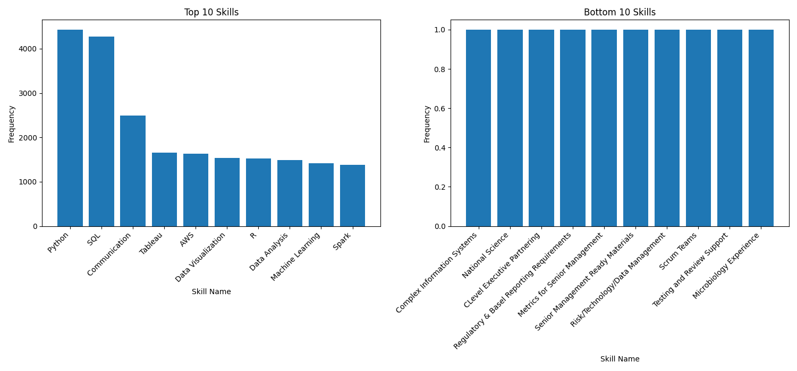  

---

### ✅ Sprint 3: Database & API Development  

- **Ticket 5**: Upload **cleaned job & skill data** to **MongoDB**.  
- **Ticket 6**: Develop **Flask API endpoints** for skill aggregation & recommendations.  

**Figure 2: Industry Keyword Distribution**  
A **bar chart** categorizing job postings based on industry-specific keywords.  
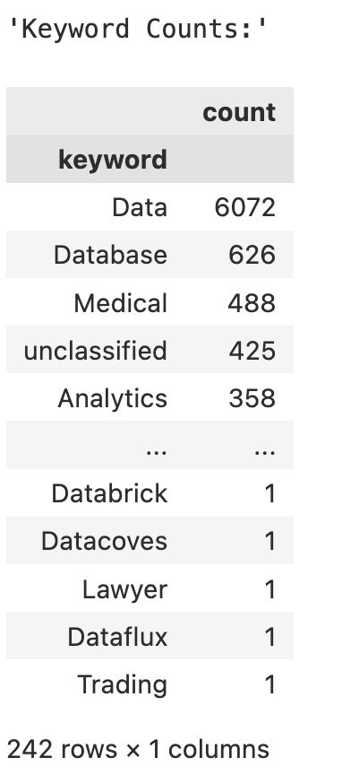  

---

### ✅ Sprint 4: Interactive Dashboard Development  

- **Ticket 7**: Build **interactive skill ranking dashboard** using JavaScript.  
- **Visualization Features**:  
  - **Job Market Overview** → Top skills across job roles & industries.  
  - **Personalized Skill Assessment** → Compare user skills with job market demands.  
  - **Interactive Filters** → Adjust by experience level, job location, or role.  
  - **Charts & Visuals** → Bar charts, heatmaps, word clouds for insights.  

---

### 🏗️ Potential Future Enhancements  

If time and resources permit, additional **AWS integrations** may be implemented for **scalability**:  
- **MongoDB Atlas** → Cloud database storage.  
- **AWS Lambda + API Gateway** → Serverless backend deployment.  
- **AWS S3 + CloudFront** → Hosting interactive dashboard for global access.  

✅ **Final Deliverables**:  
- **MongoDB database** storing job postings & skill data.  
- **Flask API** for job searches & skill recommendations.  
- **Interactive dashboard** for skill ranking & filtering.  
- **GitHub repository** with documented code & README.  


---

## 3. Data Engineering Process  

### 📂 Data Sources & Licensing  

This project utilizes **publicly available datasets** from Kaggle, ensuring proper attribution and compliance with data usage policies. The dataset is licensed under the **Open Data Commons Attribution License (ODC-By) v1.0**, allowing us to freely use, modify, and share the data as long as proper credit is given.  

- **Data Science Job Postings & Skills (2024)**  
  Dataset source: [Kaggle](https://www.kaggle.com/datasets/asaniczka/data-science-job-postings-and-skills?select=job_postings.csv)  
  **License:** Open Data Commons Attribution License (ODC-By) v1.0  

#### **Dataset Structure**  
- `job_postings.csv` → Contains job titles, descriptions, locations, etc.  
- `job_skills.csv` → Contains extracted skills from job postings.  

---

### 🔍 Data Cleaning & Processing  

#### **Handling Missing Values, Duplicates, and Inconsistencies**  
One of the biggest challenges in job market data analysis is **ensuring clean and structured data**. Before analysis, we:  
- **Removed incomplete entries** to improve dataset reliability.  
- **Identified and merged duplicate postings** while consolidating relevant job data.  

**Figure 1: Job Titles Distribution**  
A **bar chart** showing the distribution of job postings by title.  
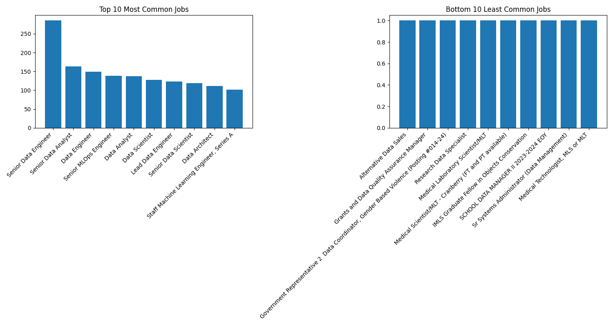  

---

#### **Job Title Normalization & Mapping**  
Standardizing job titles was essential due to variations in how they appear across postings. To ensure consistency:  
- **Mapped variations** to a standard format (e.g., "Sr. Data Analyst" → "Senior Data Analyst").  
- **Classified job levels** into **Junior, Mid, and Senior** categories based on **regex-based rules**.  
- **Filtered irrelevant or duplicated job postings** by removing listings that **lacked proper skill descriptions** or contained **redundant data**.  

---

### ⚙️ ETL Workflow Explanation  

To ensure structured and usable data, we implemented an **Extract, Transform, Load (ETL) process**:  

1. **Extract** relevant data from `job_postings.csv` and `job_skills.csv`.  
2. **Transform** job titles and skill lists using **standardization techniques**.  
3. **Load** cleaned data into **MongoDB** (details in Section 5).  

---

## 5. Skill Extraction & Ranking  

### 📊 Methodology  

Our skill extraction process was designed to:  
1. **Extract** relevant skills from job descriptions.  
2. **Categorize** skills based on relevance and industry standards.  
3. **Rank** skills by demand to highlight **key industry trends**.  

---

### 🔍 Challenges & Solutions  

#### **Handling Variations in Skill Naming**  
- Many job postings use different terminology for the same skill (e.g., **"SQL Programming" vs. "SQL"**).  
- We applied **regex-based text normalization** to standardize skill names.  
- **No NLP or machine learning techniques** were used, as they were beyond our current capabilities.  

**Figure 2: Skill Frequency Distribution**  
A **bar chart** visualizing the most frequently mentioned skills in job postings.  
  

---

#### **Limiting Focus to Top 20 Skills per Job Title**  
Given time constraints and dataset limitations, we:  
- Focused on **14 representative job titles**.  
- Extracted **only the top 20 most frequently mentioned skills** per job category.  
- Prioritized **accuracy and clarity** by ensuring minimal misinterpretation of skill labels.  

**Figure 3: Bottom 10 Least Common Skills**  
A **table listing the least common skills**, indicating potential niche job requirements.  
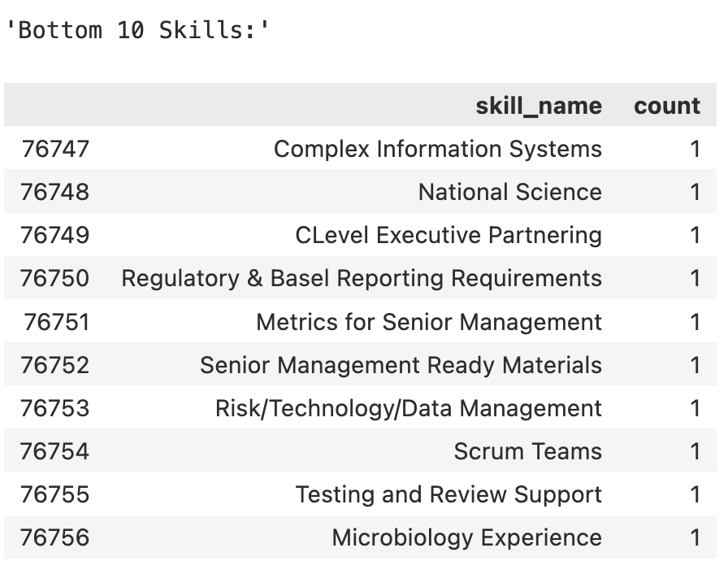  

---

## 6. Database & API Development  

### 📂 Database Choice & Justification  

We chose **MongoDB** for its flexibility in handling **nested data structures** and **unstructured job postings**. Given the variety of skills and job titles, a relational database would require excessive normalization.  

Additionally, a NoSQL approach allows us to efficiently store, query, and scale our data as job market insights evolve.  

---

### 🗂 Database Schema Design  

The **MVP database schema** was designed to meet **core data visualization needs**, ensuring clean and efficient storage of job postings, job titles, and skill rankings.  

**Figure 2: MVP Database Schema**  
A **diagram illustrating our minimum viable database structure**, optimized for visualization queries.  
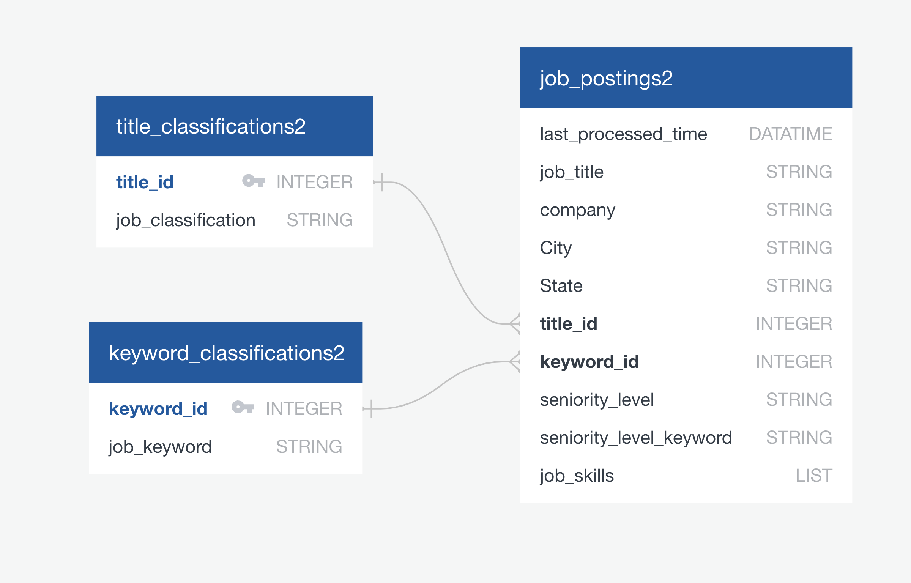  

For future scalability, we designed an **extended schema** to support **multiple data pipelines, broader job classifications, and deeper skill groupings**.  

**Figure 3: Extended Database Schema**  
A **more detailed entity-relationship diagram**, outlining potential improvements for handling additional job categories, locations, and structured skill hierarchies.  
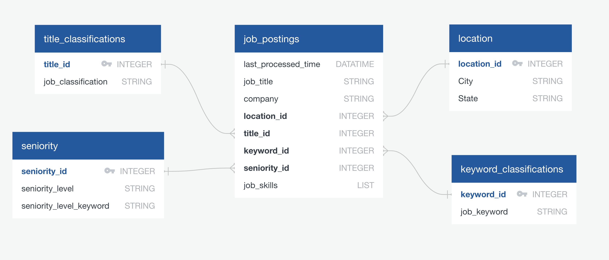  

---

### 🖥 API Functionality  

To make job market insights accessible, our API enables:  

1. **Job Title Searches** → Retrieve skill rankings for specific job titles.  
2. **Filtered Results** → Search based on **experience level, location, or industry**.  
3. **JSON Responses** → Structured outputs for seamless integration with front-end applications.  

This setup allows users to explore **data-driven career insights** dynamically while keeping the database structure optimized for fast queries.  

---

## 7. Interactive Dashboard & Visualization  

### 🖥️ Frontend Implementation  

The dashboard is built using **JavaScript (D3.js, Plotly.js)** and is designed to be **interactive and user-friendly**. The user journey consists of **three main pages**:  

---

#### 📌 **Job Categorization Index Page**  

Instead of a dropdown menu, the homepage features a **clean index page** listing all **14 job categorization titles**, each with a **brief description**.  

Each job title is visually **differentiated by colored bars**, which indicate the **generally accepted earliest seniority-based entry points** for that role. Clicking on a job title opens a **dedicated dashboard page** with **data insights specific to that role**.  

**Figure 1: Job Categorization Index Page**  
This page allows users to select a **data job category**, each visually distinguished by **seniority level indicators**.  
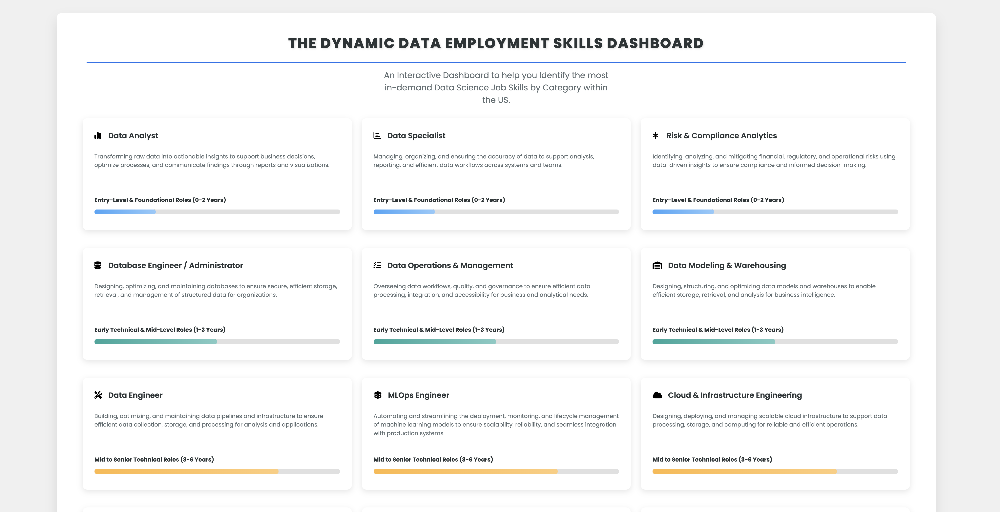  

---

#### 📌 **Job-Specific Dashboard**  

Once a job category is selected, users are directed to a **job-specific dashboard** containing:  

✅ **Job Market Insights:**  
- A **metric box** displaying the **total number of job postings** collected for the selected job title.  

✅ **Education Requirements Overview:**  
- **Three pie charts** displaying the percentage of job postings that mention:  
  - A **bachelor's degree**  
  - A **master’s degree**  
  - A **PhD**  

✅ **Skill Ranking & Customization:**  
- **Top 10 Most Commonly Listed Skills** for the selected job title, displayed in **a checklist format**.  
- **Dynamic Skill Gap Bar Chart:**  
  - As users **check off skills they already possess**, the **bar chart dynamically updates**, showing the **remaining top 10 skills they lack** for that role.  

**Figure 2: Job-Specific Dashboard**  
An interactive view of **job listings, education requirements, skill rankings, and dynamic skill gaps**.  
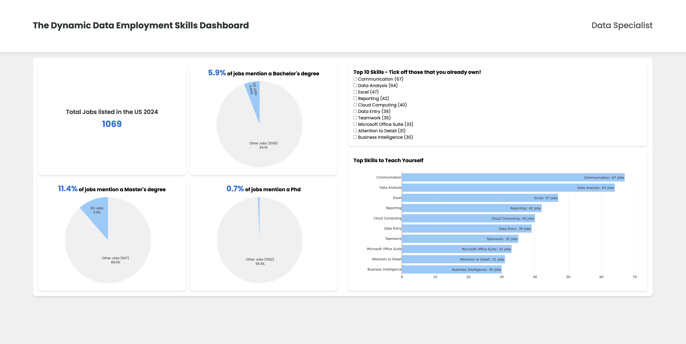  

---

#### 📌 **Ethics & Considerations Page**  

To ensure transparency in the dataset and methodology, we documented **data sources, limitations, and potential areas for future improvements** in a dedicated **Project Ethics & Considerations** section.  

This page outlines:  
- **Data Source & Licensing** → Kaggle dataset under **ODC-By 1.0 License**  
- **Scope & Limitations** → Focused on **14 job categories** with 50-100 postings per category  
- **Technical Considerations** → Built using **MongoDB, Flask API, and JavaScript**  
- **Future Enhancements** → Exploring **real-time job tracking & custom search filters**  

**Figure 3: Ethics & Considerations Page**  
This page ensures transparency in **data licensing, scope, and future improvements**.  
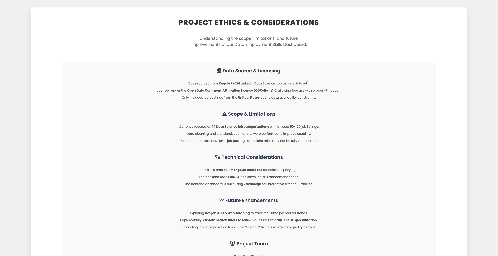  

---

### 🎨 User Experience & Design  

The dashboard integrates **multiple interactive visualizations** to provide a **clear and actionable** overview of job market expectations:  

- **Metric Box** displaying the **total number of job postings** collected for the selected job title.  
- **Education Requirement Pie Charts** breaking down the percentage of postings requiring different degree levels.  
- **Top 10 Skill Checklist** for each role, allowing users to track skills they already have.  
- **Dynamic Bar Chart** showing the **top 10 skills missing** from the user’s checked-off list.  

This structured dashboard provides **data-driven career insights**, helping users navigate **industry trends, skill requirements, and educational pathways** with clarity.  

---

## 8. Future Enhancements & Next Steps  

As a **Minimum Viable Product (MVP)**, the current **Data Employment Skills Dashboard** provides a structured and interactive way for job seekers to explore **in-demand skills and job trends**. However, several areas can be enhanced for greater functionality, accuracy, and usability.  

---

### 🚀 **Planned Enhancements**  

#### 1️⃣ **Expanding Job Categorization & Global Listings**  
- **Current Scope:** Focused on **14 U.S.-based job categories**.  
- **Next Step:** Expand to include **more specialized roles** and **international job postings**, ensuring **broader market coverage**.  
- **Challenge:** Requires **additional datasets and standardization** for consistency.  

#### 2️⃣ **Live Data Updates & Web Scraping**  
- **Current Scope:** Static dataset from **Kaggle’s 2024 LinkedIn job postings**.  
- **Next Step:**  
  - Integrate **real-time job tracking** via **web scraping**.  
  - Add **Live API connections** to pull **fresh job postings**.  
  - Implement **automated data refresh cycles** for up-to-date insights.  
- **Challenge:**  
  - Handling **data inconsistencies and job posting duplication**.  
  - Ensuring **ethical web scraping practices** and **data licensing compliance**.  

#### 3️⃣ **Custom Search Filters & Advanced User Features**  
- **Current Scope:** Users can explore **preset job categories** but cannot apply detailed filters.  
- **Next Step:**  
  - Add **custom filters** for:  
    ✅ **Experience Level** → Junior, Mid-Level, Senior.  
    ✅ **Industry Specialization** → E.g., AI, Cloud, Data Engineering.  
    ✅ **Location Preferences** → U.S. vs. International.  
  - Implement **personalized dashboards** where users can **save job preferences** and compare their **skill match against multiple roles**.  

#### 4️⃣ **Improved Skill Extraction & NLP Integration**  
- **Current Scope:** Uses **Regex-based skill extraction** for ranking.  
- **Next Step:**  
  - Introduce **Natural Language Processing (NLP)** to:  
    ✅ Identify **alternative skill names & synonyms**.  
    ✅ Cluster **similar skill groups** (e.g., "SQL" vs. "SQL Programming").  
    ✅ Improve accuracy in skill categorization.  
  - Potentially use **Machine Learning (ML)** for **trend prediction** and **personalized recommendations**.  
- **Challenge:**  
  - Requires **higher computational power** and **additional dataset training**.  

#### 5️⃣ **User Authentication & Profile-Based Recommendations**  
- **Current Scope:** Open-access dashboard with **no user login or customization**.  
- **Next Step:**  
  - Implement **user profiles** for **saved searches, tracked skills, and career suggestions**.  
  - Add **LinkedIn or GitHub API integration** for **auto-recommendations based on user profiles**.  
  - Develop a **"Skill Roadmap"** feature that suggests **learning paths based on job market trends**.  
- **Challenge:**  
  - Requires **database expansion** and **secure authentication protocols**.  

---

### 📌 **Long-Term Vision**  

Beyond incremental improvements, the goal is to evolve this dashboard into a **full-scale career intelligence tool**, offering:  
✅ **Real-time skill tracking** based on job market fluctuations.  
✅ **AI-driven career path recommendations** personalized to users.  
✅ **Seamless integration with e-learning platforms** (e.g., Coursera, Udemy, LinkedIn Learning) for **upskilling suggestions**.  

These enhancements will **ensure the dashboard remains relevant, data-driven, and user-centric**, providing **meaningful career insights** for job seekers and professionals alike.  

---

## 9. Installation & Execution  

### 🛠️ Pre-Requisites  

Before running the project, ensure you have:  
- **Python 3.8+** installed.  
- **MongoDB** installed manually (must be configured separately).  
- **Git** installed for repository cloning.  
- **Necessary Python packages** (installed automatically by the executable or manually from `requirements.txt`).  

---  

### 💻 Installation Steps  

1️⃣ **Clone the repository:**  
   ```sh  
   git clone https://github.com/Oceanpro00/Data_Employment_Skills_Dashboard.git  
   cd Data_Employment_Skills_Dashboard  
   ```  

2️⃣ **Create and activate a virtual environment:**  
   ```sh  
   conda create --name dev python=3.8  
   conda activate dev  
   ```  

3️⃣ **Install dependencies (Optional Step):**  
   - If you plan to **run the project using `run_scripts.py`**, the script will **automatically install dependencies** from `requirements.txt`, so you do **not** need to do this manually.  
   - If you plan to **run individual notebooks yourself**, you must install dependencies manually using:  
     ```sh  
     pip install -r requirements.txt  
     ```  

---  

### 🗂️ Database Setup (Manual MongoDB Installation Required)  

Since this project uses **MongoDB as the backend database**, ensure you have it **installed and running locally**.  

💪 **Start MongoDB (Default Port 27017):**  
   ```sh  
   mongod --dbpath ./data/mongodb  
   ```  

💪 **Load the cleaned dataset into MongoDB:**  
   ```sh  
   python database_creation_executable.py  
   ```  

---  

### 🔄 Running the Project (Fully Automated Execution)  

To ensure proper execution, **open your terminal or command prompt inside the `executables` folder** before running the script. If not, the script may not function correctly.  

Once dependencies are installed and MongoDB is running, the entire **data pipeline and API setup** can be executed with **one command**:  

```sh  
python run_scripts.py  
```  

This script will:  
✅ **Install dependencies** (if not already installed).  
✅ **Run all preprocessing scripts** in the correct order.  
✅ **Start the Flask API** for skill data retrieval.  
✅ **Launch the frontend dashboard** in a browser.  

---  

### 🌐 Platform-Specific Considerations (Mac vs. Windows)  

💻 **Mac/Linux Users:**  
- **Ensure MongoDB is installed** (`brew install mongodb-community@7.0`).  
- **Use Terminal** for executing commands.  

🖥 **Windows Users:**  
- **Manually install MongoDB** and start `mongod` before running scripts.  
- **Use PowerShell or Command Prompt** to execute scripts.  

---  

## 10. Conclusion

The **Data Employment Skills Dashboard** provides job seekers with valuable insights into the most in-demand skills within Data Science roles. By leveraging real-world job postings, this tool enables users to explore job market trends, assess their skillset against industry standards, and make informed career decisions.

Key takeaways from this project include:
- **Standardizing job titles and skill extraction** to reduce inconsistencies in job descriptions.
- **Providing an interactive dashboard** that allows users to visualize and explore job market trends dynamically.
- **Utilizing MongoDB, Flask, and JavaScript** to create a scalable and efficient system for querying job skills data.

While this project has successfully demonstrated how data science techniques can be used to analyze job market trends, there is always room for improvement. Future enhancements may include:
- **Expanding the dataset** to include international job postings.
- **Integrating machine learning techniques** to predict future skill demands.
- **Automating data collection** through web scraping and real-time job API integration.

This project serves as a **proof of concept** for data-driven job market analysis, with potential real-world applications in career development and workforce planning. 🚀
